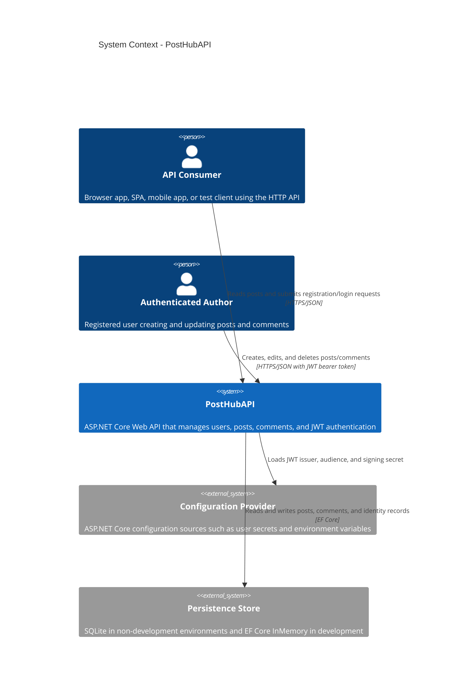
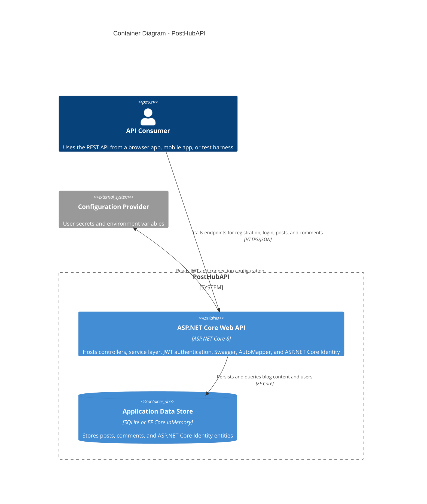
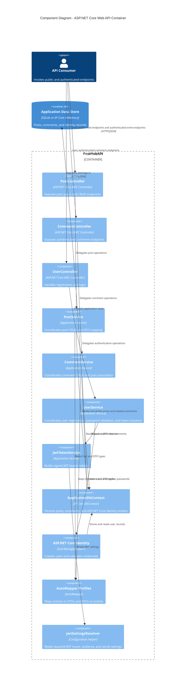

# PostHubAPI Architecture

## Overview

PostHubAPI is a single-process ASP.NET Core 8 Web API for blog-style content management. It exposes REST endpoints for user registration and login, post CRUD operations, and comment CRUD operations. The application uses ASP.NET Core Identity for credential management, JWT bearer authentication for API access, AutoMapper for DTO translation, and Entity Framework Core for persistence.

## Scope And Assumptions

- The repository contains the API only; frontend clients are modeled as external consumers.
- Authentication is handled locally inside the API rather than through an external identity provider.
- Persistence differs by environment: development uses EF Core InMemory, while non-development uses SQLite.

## System Context

## Container View

## Component View

## Runtime Responsibilities

| Area              | Primary elements                                                  | Notes                                                                                                                                                       |
| ----------------- | ----------------------------------------------------------------- | ----------------------------------------------------------------------------------------------------------------------------------------------------------- |
| API surface       | `UserController`, `PostController`, `CommentController`           | `UserController` is public for login and registration. `CommentController` is fully authorized. `PostController` allows public reads and authorized writes. |
| Application logic | `UserService`, `PostService`, `CommentService`, `JwtTokenService` | Services keep controller logic thin and centralize business behavior.                                                                                       |
| Persistence       | `ApplicationDbContext` and EF Core                                | Post-to-comment relationship is configured with cascade delete. Identity tables share the same DbContext.                                                   |
| Authentication    | ASP.NET Core Identity and JWT bearer middleware                   | Token validation uses configuration-provided issuer, audience, and secret.                                                                                  |
| Mapping           | AutoMapper profiles                                               | DTOs isolate API contracts from entity types.                                                                                                               |

## Deployment Notes

- Development mode uses the EF Core InMemory provider, which keeps setup simple but does not emulate relational behavior perfectly.
- Non-development environments use SQLite via `ConnectionStrings:DefaultConnection`.
- JWT settings are mandatory and resolved through configuration sources; the secret is expected outside source control.
- Swagger UI is enabled only in development.

## Risks And Constraints

- The current solution is a monolithic API. Scaling beyond a single process would require extracting persistence or authentication responsibilities.
- The data access strategy is tightly coupled to EF Core and the shared DbContext.
- Consumers are external to this repository, so contract changes should be treated as public API changes.

## Source Mapping

- Application composition: `Program.cs`
- Web layer: `Controllers/`
- Application services: `Services/Implementations/`
- Persistence: `Data/ApplicationDbContext.cs`
- Domain model: `Models/`
- DTO mapping: `Profiles/`
